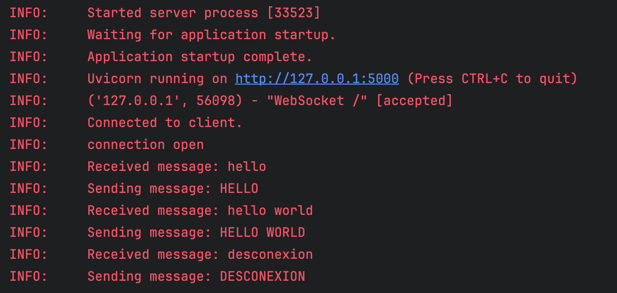
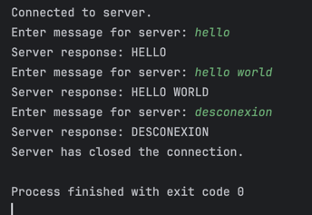

# Spike TCP client-server

## How to run

### Prerequisites

- Prerequisites
- Python 3.8+
- Poetry

### Setting Up the Environment
1. Install Poetry:  <pre>curl -sSL https://install.python-poetry.org | python3 - </pre>
2. Install Project Dependencies:  <pre>poetry install </pre>

### Running the Server

1. Activate the Poetry environment:  <pre>poetry shell </pre>
2. Run the server script:  <pre>python server.py </pre> The server will be running on http://127.0.0.1:5000.

### Running the Client
1. Ensure the server is running.  
2. Activate the Poetry environment:  <pre>poetry shell </pre>
3. Run the client script:  <pre>python client.py </pre> Follow the prompts to send messages to the server.

## Example
### Server:

### Client:
